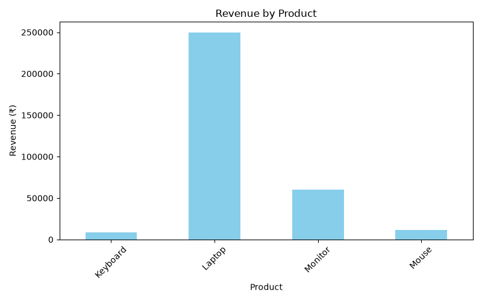
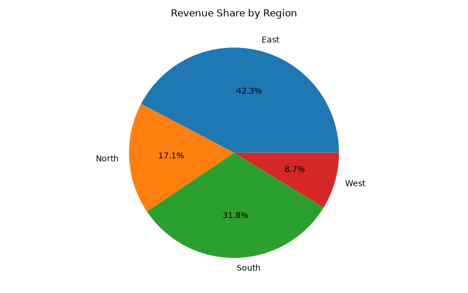
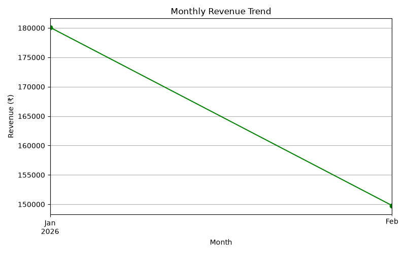

# Sales Data Analysis Using Python

## Project Overview

This project analyzes sales data using Python to identify sales trends, product performance, and regional revenue. It demonstrates basic data analysis and visualization skills.

## Objectives

* Analyze sales data using Python.
* Clean and process datasets.
* Calculate total revenue and average order value.
* Identify the best-performing products and regions.
* Visualize sales trends using charts.
* Generate a sales analysis report.

## Technologies Used

* **Python** – Programming language
* **Pandas** – Data manipulation and analysis
* **Matplotlib** – Data visualization
* **VS Code** – Development environment

## Project Structure

```text
Sales-Data-Analysis/
│
├── data/
│   ├── sales.csv
│   └── cleaned_sales.csv
│
├── images/
│   ├── revenue_by_product.png
│   ├── revenue_by_region.png
│   └── monthly_revenue.png
│
├── main.py
├── sales_report.txt
└── README.md
```

## Key Insights

* Total revenue: ₹329,900
* Highest-revenue product: Laptop
* Best-selling product by quantity: Mouse
* Highest-revenue month: January 2026

These insights are based on the sample dataset included in this project.

## How to Run the Project

1. Clone or download this repository.
2. Install Python.
3. Install the required libraries:

```bash
pip install pandas matplotlib
```

4. Run the Python file:

```bash
python main.py
```

5. View the generated charts in the `images` folder and the report in `sales_report.txt`.

## Learning Outcomes

* Data cleaning and preprocessing
* Exploratory data analysis
* Grouping and aggregation using Pandas
* Data visualization
* Generating reports from data

## Author

Hrutik NK
B.Tech Artificial Intelligence and Data Science Student

## Data Visualizations

### 1. Revenue by Product

This chart compares the total revenue generated by each product.



### 2. Revenue Share by Region

This chart shows the percentage contribution of each region to total revenue.



### 3. Monthly Revenue Trend

This chart displays the monthly revenue trend and helps identify changes in sales performance over time.



